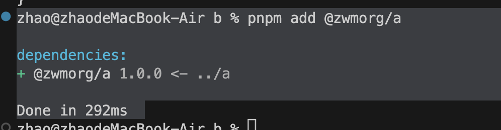
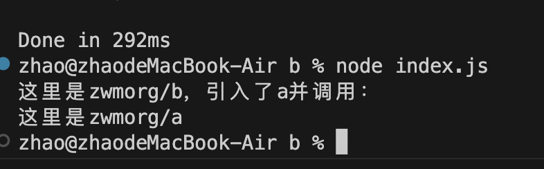

使用pnpm 搭建一个简单的Monorepo项目，并完成包的关联测试

## 什么是 Monorepo
一个代码库里包含很多的项目,而这些项目虽然是相关联的,但是在逻辑上是独立的,可以由不同人或者团队来维护

## pnpm
pnpm 对于包的管理是很方便的,尤其是对于一个 Monorepo 的项目。因为对于我们即将开发的组件库来说可能会存在多个 package(包),而这些包在我们本地是需要相互关联测试的,刚好 pnpm 就对其天然的支持。其实像其它包管理工具,比如 yarn、lerna 等也能做到,但是相对来说比较繁琐。而 pnpm 现在已经很成熟了,像 Vant，ElementUI 这些明星组件库都在使用 pnpm,因此本项目也采用 pnpm 作为包管理工具。


## 1. pnpm 安装
### 安装
`npm install pnpm`

### 初始化项目
新建一个文件夹 zwmorg;
在根目录下执行 `pnpm init`,自动生成package.json 配置文件;
```json
{
  "name": "zwmorg",
  "version": "1.0.0",
  "description": "",
  "main": "index.js",
  "scripts": {
    "test": "echo \"Error: no test specified\" && exit 1"
  },
  "keywords": [],
  "author": "",
  "license": "ISC"
}

```
### 包管理
在根目录下，新建一个packages文件夹
再新建两个文件夹，a,b
> packages
> > a
> > b

分别在a,b中执行`pnpm init`;

#### a 的修改
修改a文件夹下的package.json的name
```json
{
  "name": "@zwmorg/a",
  "version": "1.0.0",
  "description": "",
  "main": "index.js",
  "scripts": {
    "test": "echo \"Error: no test specified\" && exit 1"
  },
  "keywords": [],
  "type": "module",
  "author": "",
  "license": "ISC"
}
```
这个包输出的事index.js,在a中，新建一个index.js; 

```javascript
export default () => {
    console.log('这里是zwmorg/a')
}
```

#### b 的修改
修改b文件夹下的package.json的name
```json
{
  "name": "@zwmorg/b",
  "version": "1.0.0",
  "description": "",
  "main": "index.js",
  "scripts": {
    "test": "echo \"Error: no test specified\" && exit 1"
  },
  "keywords": [],
  "type": "module",
  "author": "",
  "license": "ISC"
}
```
这个包输出的事index.js,在b中，新建一个index.js; 

```javascript
import a from '@zwmorg/a'
console.log('这里是zwmorg/b，引入了a并调用：')
a()
```

在b文件夹中，打开终端，执行`node index.js`
由于没有关联a的包，执行会报错
```log
node:internal/errors:465
    ErrorCaptureStackTrace(err);
    ^

Error [ERR_MODULE_NOT_FOUND]: Cannot find package '@zwmorg/a' imported from /Users/zhao/code/zwmorg/packages/b/index.js
    at new NodeError (node:internal/errors:372:5)
    at packageResolve (node:internal/modules/esm/resolve:954:9)
    at moduleResolve (node:internal/modules/esm/resolve:1003:20)
    at defaultResolve (node:internal/modules/esm/resolve:1218:11)
    at ESMLoader.resolve (node:internal/modules/esm/loader:580:30)
    at ESMLoader.getModuleJob (node:internal/modules/esm/loader:294:18)
    at ModuleWrap.<anonymous> (node:internal/modules/esm/module_job:80:40)
    at link (node:internal/modules/esm/module_job:78:36) {
  code: 'ERR_MODULE_NOT_FOUND'
}
```

#### pnpm 配置 工作空间workspace
在zwmorg文件根目录下 新建一个工作空间配置文件`pnpm-workspace.yaml`;
将包进行关联
```
packages:
    - 'packages/**'

```

然后在b文件下，打开终端，执行`pnpm add @zwmorg/a`


最后执行 `node index.js`


至此，我们就实现了包的关联

## 总结
1. 使用pnpm创建一个Monorepo项目
2. 在项目中创建packages/a&packages/b两个子包，并配置pnpm的工作空间，实现包的关联；


