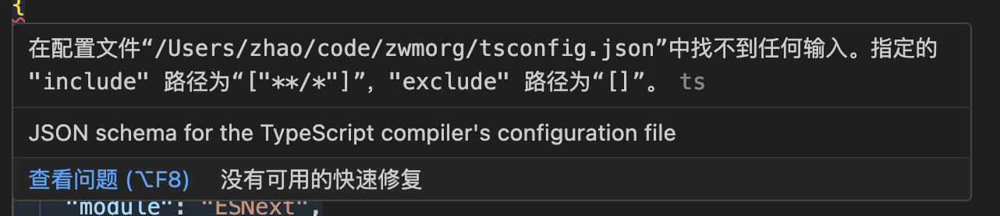

# 组件库的环境配置

本篇文章将在项目中引入 typescript,以及手动搭建一个用于测试组件库组件 Vue3 项目

因为我们是使用 Vite+Ts 开发的是 Vue3 组件库,所以我们需要安装 typescript、vue3,同时项目将采用 Less 进行组件库样式的管理
```
pnpm add vue@next typescript less -D -w
```
使用pnpm如果要安装在项目根目录下,则需要加-w

## 初始化ts
在根目录执行npx tsc --init,然后就会自动生成 ts 的配置文件tsconfig.json,然后我们对其做一个更换
```
{
  "compilerOptions": {
    "baseUrl": ".",
    "jsx": "preserve",
    "strict": true,
    "target": "ES2015",
    "module": "ESNext",
    "skipLibCheck": true,
    "esModuleInterop": true,
    "moduleResolution": "Node",
    "lib": ["esnext", "dom"]
  },
  "include": [
    "packages/**/*",
    "play/**/*"
  ],
  "exclude": []
}
```
tsconfig.json暂时先做这样一个配置,后续可能会有一定的调整


### ts 报错

#### 原因
创建tsconfig.json配置文件时，vscode会自动检测当前项目当中是否有ts文件，若没有则报错，提示用户需要创建一个ts文件后，再去使用typescript。
#### 解决方法
需要在tsconfig.json添加include和exclude的配置
在项目中创建一个.ts文件，vscode便不会再报此错误。
我们之间执行创建vue3项目即可（记得选取ts）

## 搭建一个基于 vite 的 vue3 项目
因为我们要开发的是一个 Vue3 组件库,肯定需要一个 Vue3 项目来测试我们的组件库,所以这里将自己搭建一个基于 Vite 的 Vue3 项目来对组件进行调试。因此我们在根目录新建一个叫 play 的文件夹然后初始化pnpm init,后续的组件调试就在这个项目下进行。接下来我们就开始搭建一个 Vue3+Vite 的项目

### 安装插件
我们需要安装vite和vitejs/plugin-vue插件,@vitejs/plugin-vue插件是为了解析后缀为.vue文件的。在 play 目录下执行
```
pnpm add vite @vitejs/plugin-vue -D
```

### 配置 vite.config.ts
新建vite.config.ts配置文件
```
import { defineConfig } from "vite";
import vue from "@vitejs/plugin-vue";

export default defineConfig({
  plugins: [vue()],
});
```

### 新建入口 html 文件
@vitejs/plugin-vue会默认加载 play 下的 index.html
```
<!DOCTYPE html>
<html lang="en">
  <head>
    <meta charset="UTF-8" />
    <meta http-equiv="X-UA-Compatible" content="IE=edge" />
    <meta name="viewport" content="width=device-width, initial-scale=1.0" />
    <title>play</title>
  </head>
  <body>
    <div id="app"></div>
    <script src="main.ts" type="module"></script>
  </body>
</html>

```
因为 vite 是基于 esmodule 的,所以script标签中需要添加type="module"

### app.vue
新建app.vue文件
```
<template>
  <div>启动测试</div>
</template>
```
### 入口main.ts
```
import { createApp } from "vue";
import App from "./app.vue";

const app = createApp(App);

app.mount("#app");
```

### 配置脚本启动项目

```
{
  "name": "play",
  "version": "1.0.0",
  "description": "",
  "main": "index.js",
  "scripts": {
    "dev": "vite"
  },
  "keywords": [],
  "author": "",
  "license": "ISC",
  "devDependencies": {
    "@vitejs/plugin-vue": "^4.0.0",
    "vite": "^4.1.1"
  }
}
```

因为 play 项目需要测试本地的组件库,所以也需要将 play 和我们的组件库关联在一起。修改一下pnpm-workspace.yaml文件

```
packages:
  - "packages/**"
  - "play"
  
```
此时 play 项目便可以安装本地 packages 下的包了
最后执行pnpm run dev,便可启动我们的 play 项目
